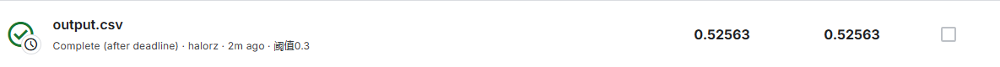

# WeedDetection
github: https://github.com/halorZero/WeedDetection

## how to start  
-- requirement.txt

-- freeze.yml

## dataset  
that is too big, so I ignore. `!!!DONT push rubbish data on repo!!!`

if you want the dataset or to know how the dataset is organized, tell me, i will give you

## code
they are messy. my fault.

-- train.py: train

-- output.py: make output.csv

-- pred_myself.py: pred using val/test.csv

`any other file, ask me.`

## method
yolo11 of ultralytics

threshold:0.3

## weights
2024.11.17: best: best.pt  

## for other groups(if exists)
the purpose of release is to share my code within out group, and also welcome other groups to improve together.

for me, copy is discouraged but allowed. `however, you should ask the teacher whether you can do it, and let me know`

## result
